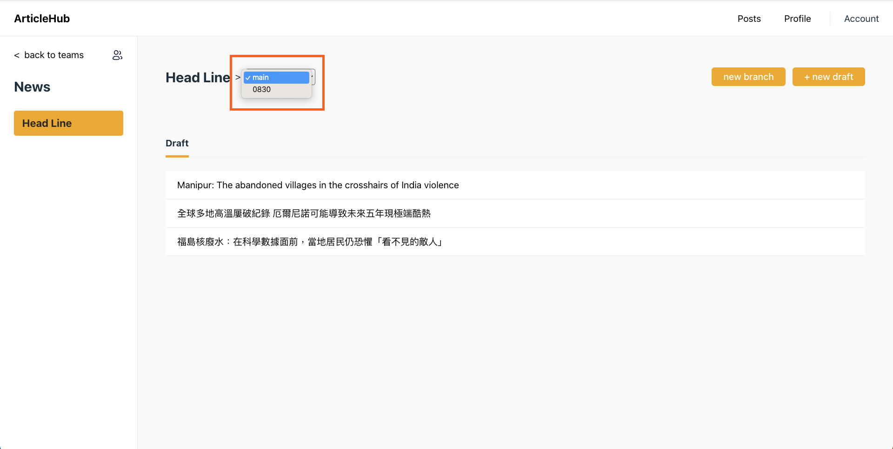
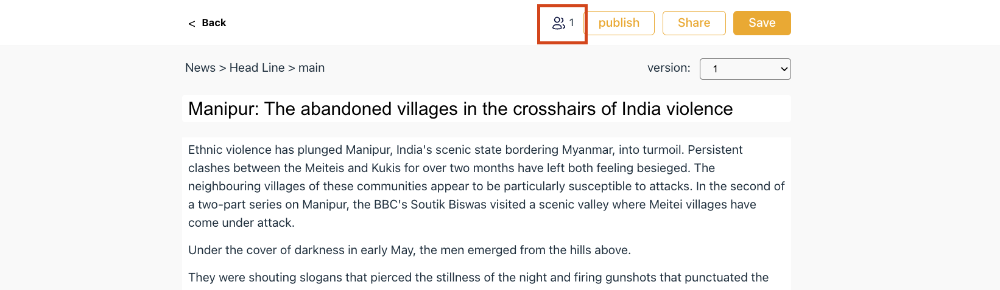
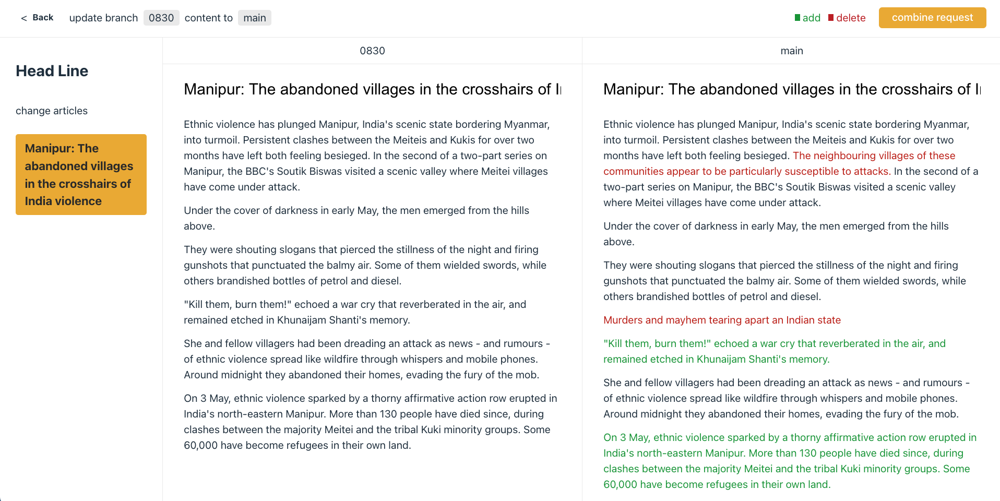
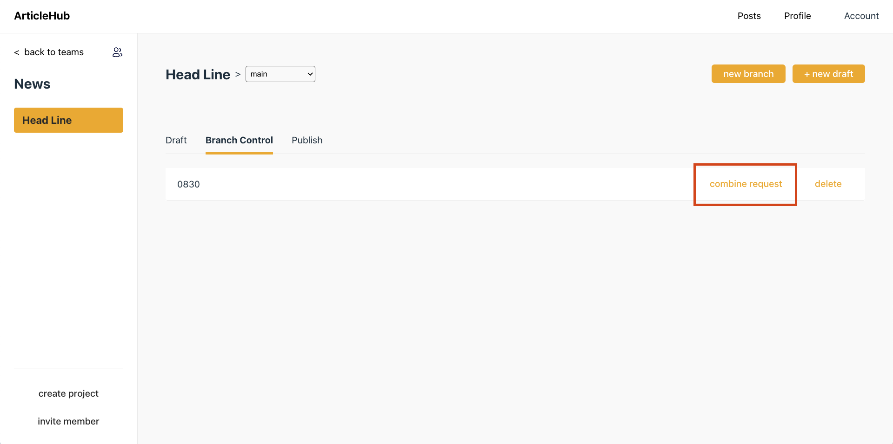
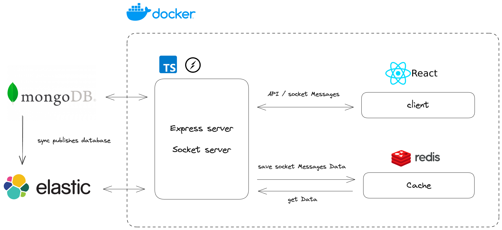

# ArticleHub

Article moderation site inspired by Git. Make it easier and more efficient for team to manage article versions.
[ArticleHub](https://emmalinstudio.com/)

## Features

#### branch create

Create a branch to allow team members to make edits to the article without affecting each other.

#### version control

Each time you save an edited article, a new version is created, allowing you to access historical versions of the edits.

#### text compare

Apart from the main branch, you have the option to compare article versions with the latest content in the main branch and indicate the added and deleted sections.

#### Share URL

Click the share button, then paste the URL to enable others to view the article and see the number of people viewing it simultaneously.

#### sync modifications to the main branch

After making modifications in the branch, send a synchronization request, and once approved, the updated content will be visible in the main branch as a new version.

Only the project creator can approve the sync request

## Server structure

## Tech Stack

**Client:** React-TypeScript, React Router, CSS/SCSS

**Server:** Node, Express, TypeScript

**DataBase:** MongoDB, Redis, Elasticsearch

**Tool:** Socket.IO, Docker

## Test Account

- email:1234@gmail.com

- password:1234

## Feedback

If you have any feedback, please reach out to us at aoao3218@gmail.com
